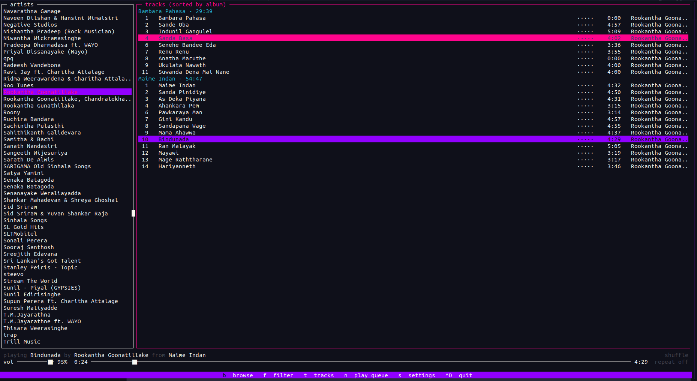
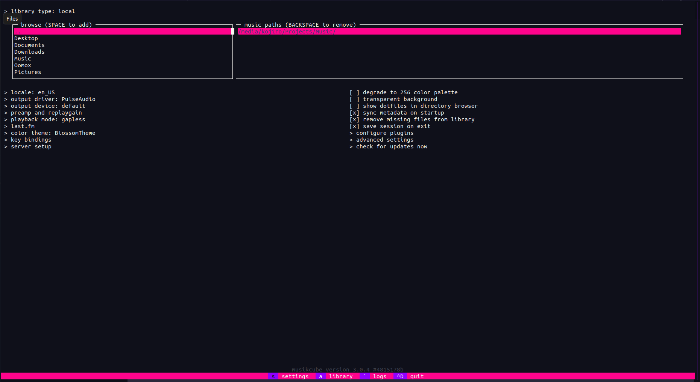

# Blossom Theme for Musikcube

## Preview



## Installation
1. Clone the repository or download as ZIP.
2. Navigate to Musikcube ```Settings```.
3. Disable ```degrade to 256 color palette```.
4. Copy the ```themes``` folder to ```~/.config/musikcube/```.
5. Go to Settings > Color Theme and enable ```BlossomTheme```
6. Enjoy!
